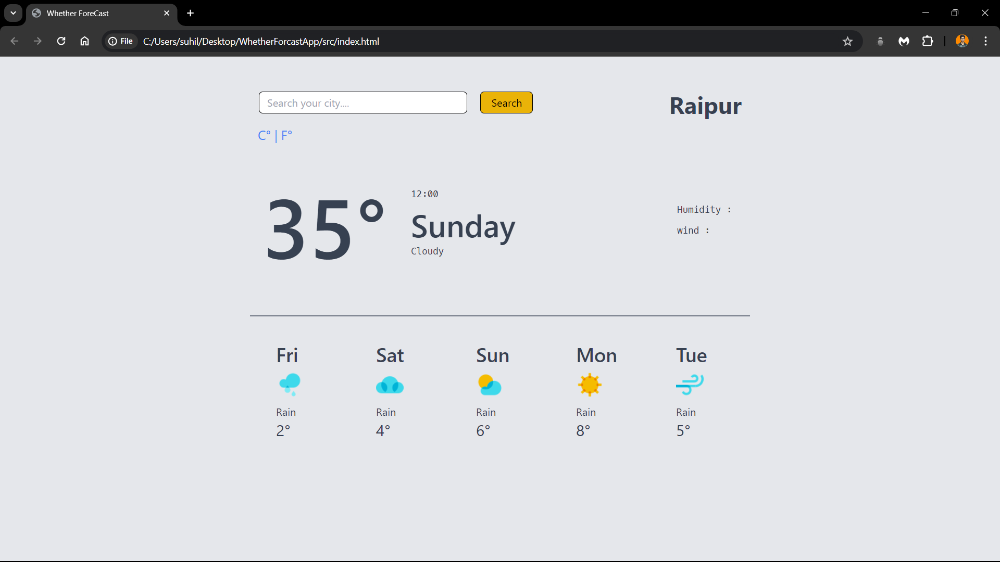

# Whether-app

Whether-app is a basic Java project that displays the temperature of the current city using an API to fetch data from the server.

## How it Works

The Whether-app utilizes an API to retrieve weather data for the current city. It then processes this data and displays the temperature to the user.

## API

The project makes use of a weather API to obtain the necessary weather data. This API provides information such as temperature, humidity, wind speed, and more for a given location.

## Screenshot

Below is a screenshot of the Whether-app:

## Usage

To use the Whether-app:

1. Clone or download the project files.
2. Open the project in your Java development environment.
3. Make sure you have the necessary dependencies installed.
4. Run the application.
5. Enter the name of your city or allow the app to access your current location.
6. The app will display the current temperature for the specified city.

## Contributing

Contributions to the Whether-app are welcome! If you have any ideas for improvements or new features, feel free to fork the repository and submit a pull request.

## License

This project is licensed under the MIT License - see the [LICENSE](LICENSE) file for details.

## Acknowledgments

Special thanks to the developers of the weather API used in this project for providing valuable weather data.

